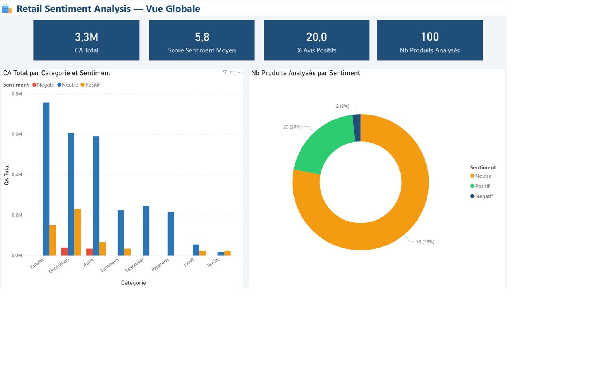
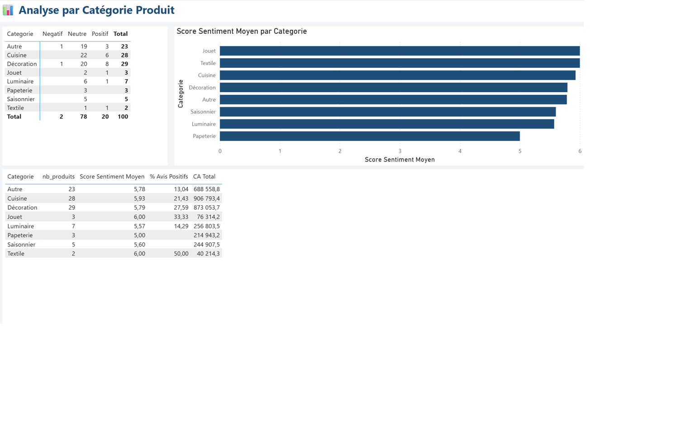

# 🛍️ Retail Sentiment Analysis — AI-Powered BI Pipeline

> End-to-end analytics pipeline combining **Data Engineering**, 
> | **AI / LLM | OpenAI GPT-4o-mini API | and **Power BI** on real retail transactional data.

## 🎯 Business Context

Retail companies generate millions of transactions but lack automated 
tools to understand **product perception** and **customer sentiment** 
at scale. This project builds a complete AI-powered pipeline to bridge 
that gap — from raw data to actionable BI dashboard.

Inspired by real-world experience at **Les Mousquetaires** (700+ stores) 
and **L'Oréal** (40+ countries).

## 🏗️ Architecture
Raw Data (541K transactions)
↓
Bronze Layer — Data Ingestion & Validation
↓
Silver Layer — Cleaning & Enrichment
↓
Gold Layer — AI Classification & Sentiment Scoring (OpenAI GPT-4o-mini)
↓
Power BI Dashboard — Business Intelligence Layer
## 🔧 Tech Stack

| Layer | Technology |
|---|---|
| Data Engineering | Python, Pandas, OpenPyXL |
| AI / LLM | OpenAI GPT-4o-mini API |
| Architecture | Medallion (Bronze/Silver/Gold) |
| Visualisation | Power BI Desktop |
| Version Control | Git, GitHub |

## 📊 Dashboard Preview

### Vue Globale


### Analyse par Catégorie


### Top Produits


## 🚀 Key Results

- **541,910** raw transactions processed
- **100** top products AI-classified into 8 categories
- **Sentiment scoring** : 20% Positive, 78% Neutral, 2% Negative
- **Top category** : Cuisine & Décoration = 57% of analyzed revenue
- **Performance** : GPT-4o-mini processes 100 products in ~40 seconds

## 📁 Project Structure
retail-sentiment-analytics/
│
├── data/                          # Data files (gitignored)
├── notebooks/
│   ├── 01_exploration.ipynb       # Data Engineering & EDA
│   └── 02_sentiment_analysis.ipynb # AI Classification & Sentiment
├── screenshots/                   # Dashboard previews
├── .env                           # API keys (gitignored)
├── .gitignore
└── README.md
## ⚙️ How to Run

```bash
# 1. Clone the repo
git clone https://github.com/[your-username]/retail-sentiment-analytics

# 2. Install dependencies
pip install openai pandas openpyxl jupyter python-dotenv

# 3. Add your OpenAI API key in .env
OPENAI_API_KEY=sk-...

# 4. Download dataset
# https://archive.ics.uci.edu/dataset/502/online+retail+ii
# Place in /data folder

# 5. Run notebooks in order
jupyter notebook
```

## 👤 Author

**Yaakoub Fajraoui**  
Senior Analytics Engineer | Power BI & Microsoft Fabric Expert  
[LinkedIn](https://linkedin.com/in/yaakoubfajraoui)
